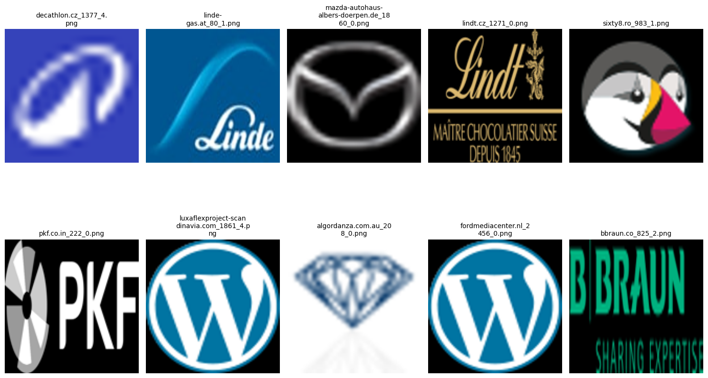
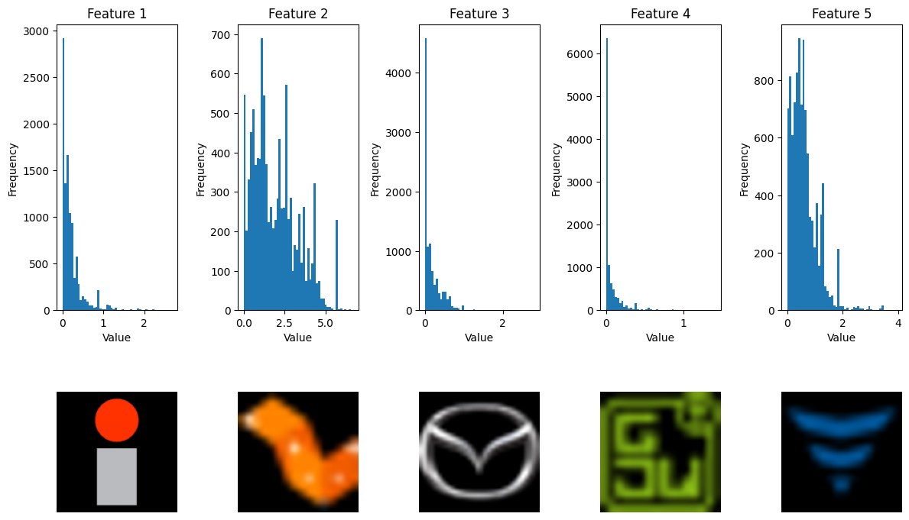
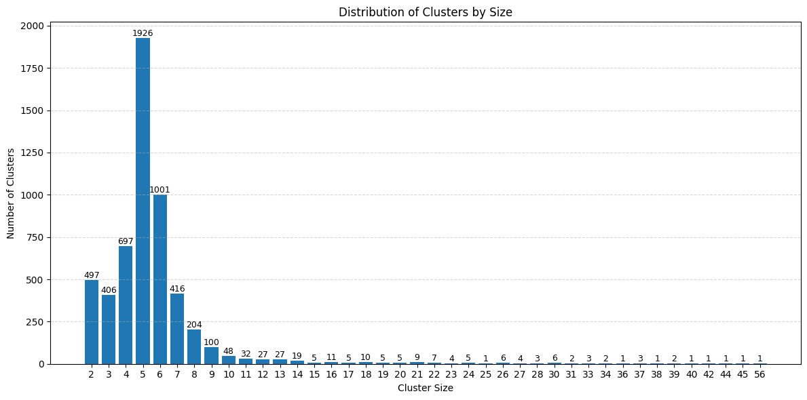
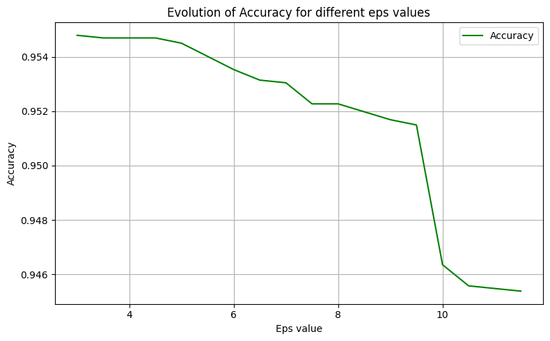
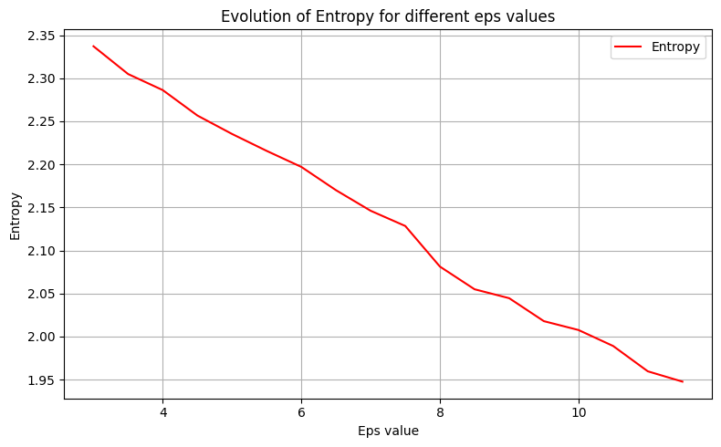
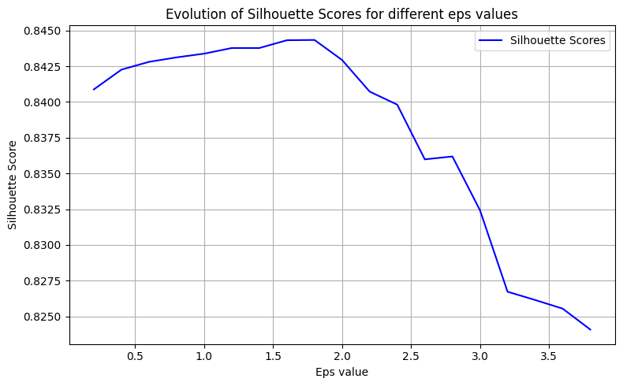
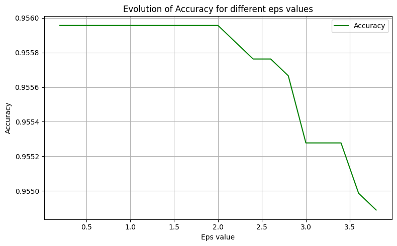
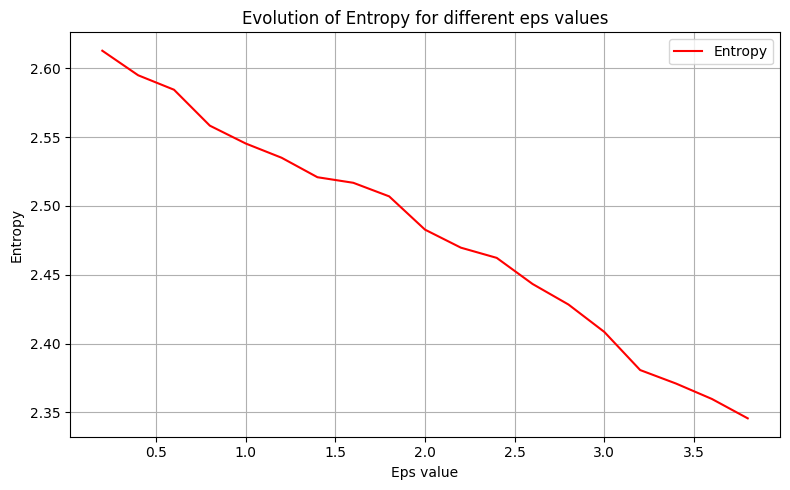

# Logo Similarity
This project aims to group company logos based on visual similarity. For each company, there are multiple images of its logo, and the goal is to identify and group these images according to the company they belong to. The program analyzes and organizes the logos, correctly associating each set of images with the corresponding company.

## Stages
### Stage I: Image Collection via Web Scraping
In the first stage, using the dataset `logos.snappy.parquet`, which contains the domains of multiple websites, a web scraper was implemented to collect as many images from these sites as possible. The primary goal was to identify images that could correspond to logos.

### Stage II: Feature Extraction Methods
In the second stage, the images from the dataset are loaded. Two methods are used for feature extraction: applying Principal Component Analysis (PCA) and using the deep learning model ResNet50.

### Stage III: Analysis of Unsupervised Clustering Results
In the final stage, based on the extracted features, an unsupervised clustering method was applied to group the logos based on visual similarity. The connections between the classified logos and their domains from the dataset were established. Various metrics were then used to evaluate how well the clustering correctly assigned logos belonging to the same companies. Depending on the method used, different results were obtained and compared.

***

## Stage I: Image Collection via Web Scraping

In the first stage of the project, the goal was to collect images from websites, with a special focus on identifying images that could correspond to company logos.

```text
The folder './dataset/' has been created.
Domain has size 4384.
0                        stanbicbank.co.zw
1                           astrazeneca.ua
2              autosecuritas-ct-seysses.fr
3                                   ovb.ro
4    mazda-autohaus-hellwig-hoyerswerda.de
5          toyota-buchreiter-eisenstadt.at
6                                  ebay.cn
7                  greatplacetowork.com.bo
8                  wurth-international.com
9                      plameco-hannover.de
Name: domain, dtype: object
```

The `get_logo_from_html(domain)` function was used to extract images from the webpages of the specified domains.

### 1. Accessing URLs
The function attempts to access multiple variations of URLs for each domain to ensure that a functional URL is found:
- `https://www.{domain}`
- `http://www.{domain}`
- `https://{domain}`
- `http://{domain}`

### 2. Searching for Relevant Images
After obtaining the HTML page, the function uses **BeautifulSoup** to parse the content and search for all `` tags, which contain the sources of the images. In this way, all images from the website are obtained. However, since not all images are automatically logos, a filter is applied based on the following conditions to save only the images that appear to be logos:

- **Searching within the `<header>` tag**:
  - If the image is found within a `<header>` tag, which is often used for visible sections of websites (where logos are typically located), and if the image's `alt` attribute contains the word "logo" or if the image file name contains the words "logo" or "favicon," the image is considered relevant.

- **`<link>` tags with `rel='icon'` or `rel='shortcut icon'` attributes**:
  - These tags are used to specify the site favicons, which are usually logos. These images are also added to the list of relevant images.

- **Manually adding `/favicon.ico`**:
  - By default, `/favicon.ico` is added to the list of images, as this is the standard location for favicons used by many sites.

- **Checking Image Dimensions**:
  - It is required that the dimensions of these images be smaller than 512px in both width and height, as logos typically have smaller dimensions.

### 3. Saving Images to the Dataset
Finally, only the images from the website that meet the conditions listed above are saved to the dataset.

The process was repeated for each domain in the dataset to collect as many images that appeared to be logos as possible.

### Stage II: Feature Extraction Methods

In the second stage, feature extraction from the images was performed using multiple methods in order to identify the most efficient approach.

The images were loaded into a dataloader with batches of size 32, and various transformations were applied. Ten images were displayed to verify that everything went as expected.

```text
There are 323 batches of size torch.Size([32, 3, 128, 128]), with a total of 10308 images.
```



The first method for feature extraction was PCA. Incremental PCA was applied, using 100 components, to handle larger datasets.

```text
The data has been reduced to the size: (10308, 100)
```

The second method for feature extraction involved a pre-trained ResNet50 model. Labels were omitted since only the features were of interest. To verify correctness, various statistics were calculated, and histograms for the first five features were displayed to visualize their distribution.

```text
Using device: cuda
GPU: NVIDIA GeForce GTX 1650

ResNet: 10308 images with 2048 features

Mean: [0.21319568 1.9578316  0.17940114 ... 0.11183425 0.07484497 0.31843275]
Standard deviation: [0.27534822 1.3775853  0.24292699 ... 0.2270839  0.27999243 0.3521031 ]
Min: [0. 0. 0. ... 0. 0. 0.]
Max: [2.6705751 6.694772  2.804187  ... 2.424533  3.3730602 4.1690435]

[[3.59074652e-01 1.35151386e+00 0.00000000e+00 ... 7.53327787e-01
  0.00000000e+00 2.61093900e-02]
 [2.00723544e-01 3.62281418e+00 6.21539950e-01 ... 0.00000000e+00
  3.34963645e-03 4.91689622e-01]
 [1.03493363e-01 1.16012383e+00 9.63082910e-02 ... 0.00000000e+00
  0.00000000e+00 6.16859719e-02]
 [2.98003037e-03 2.31155634e+00 1.08503565e-01 ... 0.00000000e+00
  2.03041673e-01 8.14094022e-02]
 [1.46536633e-01 5.64780045e+00 0.00000000e+00 ... 4.97114882e-02
  0.00000000e+00 2.15474993e-01]]
```



## Stage III: Analysis of Unsupervised Clustering Results

In the final stage, unsupervised clustering was applied to the previously extracted features, and different parameters were experimented with to achieve the best results.

First, the company names were extracted from the domain list by analyzing the common prefixes. For better understanding, we will use the following list of domains as an example:

- aamcobakersfield-unionave.com
- aamcobakersfield-whiteln.com
- aamcoflagstaff.com
- aamcofontanaca.com
- shopee.com

1. **`split_strings(strings, split='.')`**:  
   For all the domains, only the part before the "." was kept, as it contains the company names. The result will be:
   - aamcobakersfield-unionave
   - aamcobakersfield-whiteln
   - aamcoflagstaff
   - aamcofontanaca
   - shopee

2. **`find_prefixes(strings, threshold=3)`**:  
   The list was sorted, and common prefixes between the domains were identified by comparing each element with the next one. If the prefix length exceeds the specified threshold, it is added to the prefix set. The result will be:
   - aamcobakersfield-
   - aamcof
   - shopee

3. **`refine_prefixes(prefixes, strings)`**:  
   It is possible that some prefixes are included in others, so prefixes that already contain other prefixes are removed. The final result will be:
   - aamco
   - shopee

Thus, the company names are obtained. For each company, a list is allocated to count how many classes it appears in and how many times.

```text
Domain                                             Company Name
mazdaofconshohocken.com........................... mazda
renault.dk........................................ renault
aamco-omahanorth.com.............................. aamco
aamcoeastbrunswick.com............................ aamco
bakertilly.ke..................................... bakertilly
reedglobal.com.mt................................. reedglobal
kia.pt............................................ kia
bioderma-sk.com................................... bioderma
culliganofsouthwestwisconsin.com.................. culligan
ford.dn.ua........................................ ford
toyotaortakoy.com.tr.............................. toyota
veolia.am......................................... veolia
internationalsos.no............................... inter
hertz.yt.......................................... hertz
daikineastafrica.com.............................. daikin
allianzgloballife.com............................. allianz
martinavenueshops.com............................. martinavenueshops
aamcotransmissionpensacola.com.................... aamco
aamcoeastmesa.com................................. aamco
toyotagocmenturk.com.tr........................... toyota
mapfre.com.sv..................................... mapfre
nikonlenswear.cn.................................. nikon
murrelektronik.uk................................. murrelektronik
job-impulse.sk.................................... job-impulse
toyotayigitvar.com.tr............................. toyota
kia-beyschlag.at.................................. kia-
kia-beyschlag.at.................................. kia
ecochillers.net................................... ecochillers
mazda.ph.......................................... mazda
murrelektronik.fr................................. murrelektronik
mazda-autohaus-ruettiger-wallduern.de............. mazda
```

To understand how well the classification was performed, a metric was implemented to calculate the extent to which a cluster contains logos of a single company. For better understanding, we will use the following two clusters and the images they contain as an example:

**Cluster 1:**
- toyotafocsani.ro_253_3.png
- toyota-handler.at_3237_0.png
- wwf.es_3973_0.png
- toyotahizel.com.tr_3100_2.png
- toyota-niederberger.at_2610_5.png
- yves-rocher.ch_2257_2.png
- toyota-niederberger.at_2610_4.png
- toyotaparmaksizlar.com.tr_1301_0.png

**Cluster 2:**
- europa-union-niedersachsen.de_1062_0.png
- europa-union-sachsen.de_2309_0.png
- esseskincare.hk_4129_0.png
- europa-union-sachsen-anhalt.de_37_0.png
- europa-union-thueringen.de_869_0.png

1. **`count_companies_in_label(company_names, domains)`**:  
   For each domain in the cluster, it is checked which company it belongs to. After processing all the domains, the occurrences of each company name are counted, and the number of appearances is stored. The company with the most appearances in a cluster is considered to represent that cluster. Finally, the extent to which the company is present in the cluster is calculated.  
   
     - **Toyota** is the most present in **Cluster 1**, with a proportion of **70%**:
       - toyotafocsani.ro_253_3.png
       - toyota-handler.at_3237_0.png
       - wwf.es_3973_0.png
       - toyotahizel.com.tr_3100_2.png
       - toyota-niederberger.at_2610_5.png
       - yves-rocher.ch_2257_2.png
       - toyota-niederberger.at_2610_4.png
       - toyotaparmaksizlar.com.tr_1301_0.png

     - **Europa-Union** is the most present in **Cluster 2**, with a proportion of **80%**:
       - europa-union-niedersachsen.de_1062_0.png
       - europa-union-sachsen.de_2309_0.png
       - esseskincare.hk_4129_0.png
       - europa-union-sachsen-anhalt.de_37_0.png
       - europa-union-thueringen.de_869_0.png

2. **`calculate_weighted_accuracy(company_names, clustered_data)`**:  
   A weighted accuracy is calculated to determine the accuracy over the entire dataset. The function iterates through all the clusters and obtains the accuracy for each cluster. All the obtained values are multiplied by the size of the respective cluster, and thus a global accuracy is obtained over the entire dataset, weighted according to the cluster sizes.  

   The overall accuracy for the previous example would be calculated as:
   $$
   \text{Overall Accuracy} = \frac{(0.7 \times 8) + (0.8 \times 5)}{8 + 5} = \frac{5.6 + 4}{13} = \frac{9.6}{13} \approx 0.738
   $$
   This metric gives us an insight into how well the classification was performed, and the weights take into account the size of the clusters.

The method described earlier is a good indicator for understanding each cluster individually, but situations can arise where the images with a company's logo are distributed across multiple clusters. For example, if we have 5 clusters that only contain the logos of the same company, the accuracy obtained earlier will be 100% because all 5 clusters contain logos from a single company. However, the issue arises because these logos are split across multiple clusters.

To understand how the logos of a company are distributed across clusters and to what extent, we will calculate entropy. In the previous steps, when calculating the accuracy, we counted and recorded how many clusters each company appears in and how many times its logos appear in each. This list of appearances can be considered as a distribution. To make it clearer, let's consider the following examples:
- **Toyota**: `[22, 2, 1]` (The images with the Toyota logo were classified into 3 clusters. One cluster contains 22 images with the Toyota logo, and the other two clusters contain 2 and 1 images, respectively.)
- **Europa-Union**: `[4, 4, 6]` (The images with the Europa-Union logo were classified into 3 clusters. One cluster contains 4 images with the Europa-Union logo, and the other two clusters contain 4 and 6 images, respectively.)

#### 1. **`calculate_entropy(distribution)`**:  
Entropy is a measure of uncertainty or disorder in a dataset. It can be calculated based on a given distribution. The formula used for calculating entropy is based on Shannon's entropy formula:
   $$
   H(X) = - \sum_{i} p_i \cdot \log_2(p_i)
   $$
Entropy quantifies the uncertainty in a distribution, where a higher entropy indicates greater uncertainty. We want to obtain the smallest possible entropy. In the ideal case, when entropy is 0, it means all images with the company's logo are classified into a single cluster.

   - For **Toyota**: `[22, 2, 1]`, the entropy is 0.64.
   - For **Europa-Union**: `[4, 4, 6]`, the entropy is 1.55. It is much higher because the elements of the distribution are more evenly split.

#### 2. **`calculate_weighted_entropy(company_names)`**:  
To obtain a global entropy, we calculate the weighted entropy. After calculating the entropy for each company (based on the distribution of its logos), a weighted average of these entropies is computed according to each company's contribution to the overall dataset. The formula for weighted entropy is:

   $$
   H_{\text{total}} = \sum_i \left( \frac{k_i}{N} \cdot H_i \right)
   $$

   - For the companies **Toyota**: `[22, 2, 1]` and **Europa-Union**: `[4, 4, 6]`, the global entropy is 0.958. Due to the fact that **Toyota** has more elements in its distribution, it has a greater influence on the final result. \

This metric provides a way to evaluate how diverse the dataset is, weighted by the size of each company's distribution.

In the final step, unsupervised clustering is applied using the **DBSCAN** algorithm. For both feature sets obtained from **PCA** and the **ResNet deep learning model**, the DBSCAN algorithm is used to classify images containing company logos.  

An important factor in the DBSCAN algorithm is the **epsilon (`eps`)** parameter, which determines the maximum distance between two points for them to be considered neighbors. The grouping of points into the same cluster depends on both the number of neighbors a point has and the value of `eps`.  

To experiment, multiple values for `eps` were tested for each feature set to analyze how the results evolved. The classification performance was evaluated using both the two previously described metrics and the **Silhouette Score**, which measures how well points are grouped within a cluster. This is done by comparing the **average distance between a point and the other points in its own cluster** with the **average distance to the nearest neighboring cluster**.  

For both the **PCA-derived** and **ResNet-generated** feature sets, the best value for the **eps** parameter among those tested was identified. Based on the three metrics calculated at each iteration, a **weighted total score** was determined for each classification corresponding to a given `eps` value. At the end, the results were displayed:
- **Graphs** illustrating the evolution of the metrics as a function of **eps**.  
- **The best eps value** identified.  
- **A few example clusters** obtained in the final classification.







```text
The ideal eps value is: 7.0
Silhouette Score: 0.872673684905275
Accuracy: 0.9530461777260381
Entropy: 2.1460805191306

Total clusters: 1813
5 random clusters selected from the most populated ones:
Cluster 795 (32 items, inter - 100.00%):
   - intersport-arc1950.com_239_0.png
   - intersport-arc1950.com_239_1.png
   - intersport-arc1950.com_239_3.png
   - intersport-arc1950.com_239_5.png
   - intersport-arc2000.com_2579_0.png
   - intersport-arc2000.com_2579_1.png
   - intersport-arc2000.com_2579_3.png
   - intersport-arc2000.com_2579_5.png
   - intersport-arvieux.com_971_0.png
   - intersport-arvieux.com_971_1.png
   - intersport-arvieux.com_971_3.png
   - intersport-arvieux.com_971_5.png
   - intersport-courchevel1550.com_2109_0.png
   - intersport-courchevel1550.com_2109_1.png
   - intersport-courchevel1550.com_2109_3.png
   - intersport-courchevel1550.com_2109_5.png
   - intersport-courchevel1850.com_602_0.png
   - intersport-courchevel1850.com_602_1.png
   - intersport-courchevel1850.com_602_3.png
   - intersport-courchevel1850.com_602_5.png
   - intersport-grandbornand.com_652_0.png
   - intersport-grandbornand.com_652_1.png
   - intersport-grandbornand.com_652_3.png
   - intersport-grandbornand.com_652_5.png
   - intersport-lesrousses.com_3524_0.png
   - intersport-lesrousses.com_3524_1.png
   - intersport-lesrousses.com_3524_3.png
   - intersport-lesrousses.com_3524_5.png
   - intersport-risoul.com_1054_0.png
   - intersport-risoul.com_1054_1.png
   - intersport-risoul.com_1054_3.png
   - intersport-risoul.com_1054_5.png

Cluster 867 (98 items, kia- - 100.00%):
   - kia-ahs-roehrnbach.de_2162_0.png
   - kia-ahs-roehrnbach.de_2162_1.png
   - kia-auto-center-weiterstadt.de_3088_0.png
   - kia-auto-center-weiterstadt.de_3088_1.png
   - kia-bachmann-wehretal.de_773_0.png
   - kia-bachmann-wehretal.de_773_1.png
   - kia-bender-coburg.de_1703_0.png
   - kia-bender-coburg.de_1703_1.png
   - kia-brass-frankfurt.de_775_0.png
   - kia-brass-frankfurt.de_775_1.png
   - kia-brueggemann-brandenburg.de_2522_0.png
   - kia-brueggemann-brandenburg.de_2522_1.png
   - kia-brueggemann-neubrandenburg.de_1750_0.png
   - kia-brueggemann-neubrandenburg.de_1750_1.png
   - kia-burian-celle.de_2503_0.png
   - kia-burian-celle.de_2503_1.png
   - kia-car-center-wismar.de_3634_0.png
   - kia-car-center-wismar.de_3634_1.png
   - kia-christ-ansbach.de_668_0.png
   - kia-christ-ansbach.de_668_1.png
   - kia-daehn-goeritz.de_1270_0.png
   - kia-daehn-goeritz.de_1270_1.png
   - kia-diamant-wiesbaden.de_843_0.png
   - kia-diamant-wiesbaden.de_843_1.png
   - kia-dresen-neuss.de_1834_0.png
   - kia-dresen-neuss.de_1834_1.png
   - kia-ds-lampertheim.de_1823_0.png
   - kia-ds-lampertheim.de_1823_1.png
   - kia-duerkop-hannover.de_3318_0.png
   - kia-duerkop-hannover.de_3318_1.png
   - kia-ebner-baienfurt.de_2025_0.png
   - kia-ebner-baienfurt.de_2025_1.png
   - kia-engbert-datteln.de_3823_0.png
   - kia-engbert-datteln.de_3823_1.png
   - kia-etehad-halstenbek.de_2364_0.png
   - kia-etehad-halstenbek.de_2364_1.png
   - kia-fischer-cottbus.de_1425_0.png
   - kia-fischer-cottbus.de_1425_1.png
   - kia-fischer-muenchberg.de_3960_0.png
   - kia-fischer-muenchberg.de_3960_1.png
   - kia-fugel-dresden.de_2789_0.png
   - kia-fugel-dresden.de_2789_1.png
   - kia-gj-remagen-rolandseck.de_822_0.png
   - kia-gj-remagen-rolandseck.de_822_1.png
   - kia-gorny-eislingen.de_155_0.png
   - kia-gorny-eislingen.de_155_1.png
   - kia-guenther-dingelstaedt.de_3496_0.png
   - kia-guenther-dingelstaedt.de_3496_1.png
   - kia-h-p-schiffweiler.de_3662_0.png
   - kia-h-p-schiffweiler.de_3662_1.png
   - kia-hoff-trier.de_2396_0.png
   - kia-hoff-trier.de_2396_1.png
   - kia-hotz-gardelegen.de_646_0.png
   - kia-hotz-gardelegen.de_646_1.png
   - kia-jaeger-bevern.de_2829_0.png
   - kia-jaeger-bevern.de_2829_1.png
   - kia-koenig-teltow.de_1127_0.png
   - kia-koenig-teltow.de_1127_1.png
   - kia-kroppen-herten.de_1468_0.png
   - kia-kroppen-herten.de_1468_1.png
   - kia-kurt-recklinghausen.de_1051_0.png
   - kia-kurt-recklinghausen.de_1051_1.png
   - kia-lange-gosen.de_3833_0.png
   - kia-lange-gosen.de_3833_1.png
   - kia-levy-wittenberg.de_1829_0.png
   - kia-levy-wittenberg.de_1829_1.png
   - kia-maier-cham.de_2940_0.png
   - kia-maier-cham.de_2940_1.png
   - kia-moeller-eisenach.de_275_0.png
   - kia-moeller-eisenach.de_275_1.png
   - kia-moeller-wunstorf.de_10_0.png
   - kia-moeller-wunstorf.de_10_1.png
   - kia-mueller-genthin.de_294_0.png
   - kia-mueller-genthin.de_294_1.png
   - kia-penning-zetelneuenburg.de_1115_0.png
   - kia-penning-zetelneuenburg.de_1115_1.png
   - kia-poeschl-bensheim.de_4261_0.png
   - kia-poeschl-bensheim.de_4261_1.png
   - kia-sauter-albstadt.de_2952_0.png
   - kia-sauter-albstadt.de_2952_1.png
   - kia-schmid-hoehenkirchen.de_1330_0.png
   - kia-schmid-hoehenkirchen.de_1330_1.png
   - kia-schunke-aurich.de_1461_0.png
   - kia-schunke-aurich.de_1461_1.png
   - kia-settele-neu-ulm.de_1789_0.png
   - kia-settele-neu-ulm.de_1789_1.png
   - kia-strehle-dresden.de_673_0.png
   - kia-strehle-dresden.de_673_1.png
   - kia-suedmobile-radolfzell.de_78_0.png
   - kia-suedmobile-radolfzell.de_78_1.png
   - kia-telke-badschlema.de_1825_0.png
   - kia-telke-badschlema.de_1825_1.png
   - kia-trinkle-schorndorf.de_3170_0.png
   - kia-trinkle-schorndorf.de_3170_1.png
   - kia-vogt-finningen.de_1182_0.png
   - kia-vogt-finningen.de_1182_1.png
   - kia-wandscher-oldenburg.de_3635_0.png
   - kia-wandscher-oldenburg.de_3635_1.png

Cluster 54 (29 items, airbnb - 100.00%):
   - airbnb.am_4316_0.png
   - airbnb.ba_2160_0.png
   - airbnb.be_3119_0.png
   - airbnb.ca_4208_0.png
   - airbnb.cl_3688_0.png
   - airbnb.co.id_4212_0.png
   - airbnb.co.in_1093_0.png
   - airbnb.co.kr_3493_0.png
   - airbnb.com.ar_675_0.png
   - airbnb.com.au_2875_0.png
   - airbnb.com.bo_2138_0.png
   - airbnb.com.br_3276_0.png
   - airbnb.com.co_3301_0.png
   - airbnb.com.hk_754_0.png
   - airbnb.com.pe_634_0.png
   - airbnb.com.ro_1718_0.png
   - airbnb.com.tw_761_0.png
   - airbnb.com.vn_4051_0.png
   - airbnb.cz_611_0.png
   - airbnb.dk_2213_0.png
   - airbnb.fr_3643_0.png
   - airbnb.hu_3933_0.png
   - airbnb.ie_2646_0.png
   - airbnb.jp_2667_0.png
   - airbnb.nl_2004_0.png
   - airbnb.no_1765_0.png
   - airbnb.rs_270_0.png
   - airbnb.ru_3699_0.png
   - airbnb.si_4094_0.png

Cluster 1121 (64 items, nestle - 100.00%):
   - nestle-caribbean.com_1216_2.png
   - nestle-caribbean.com_1216_4.png
   - nestle-esar.com_3525_2.png
   - nestle-esar.com_3525_4.png
   - nestle-mena.com_1148_2.png
   - nestle-mena.com_1148_4.png
   - nestle.at_849_2.png
   - nestle.at_849_4.png
   - nestle.ba_2468_2.png
   - nestle.ba_2468_4.png
   - nestle.bg_518_2.png
   - nestle.bg_518_4.png
   - nestle.ch_136_2.png
   - nestle.ch_136_4.png
   - nestle.co.kr_3682_2.png
   - nestle.co.kr_3682_4.png
   - nestle.co.nz_2100_2.png
   - nestle.co.nz_2100_4.png
   - nestle.com.ar_3837_2.png
   - nestle.com.ar_3837_4.png
   - nestle.com.bd_4145_2.png
   - nestle.com.bd_4145_4.png
   - nestle.com.bo_3555_2.png
   - nestle.com.bo_3555_4.png
   - nestle.com.pe_3486_2.png
   - nestle.com.pe_3486_4.png
   - nestle.com.py_4296_2.png
   - nestle.com.py_4296_4.png
   - nestle.com.sg_2570_2.png
   - nestle.com.sg_2570_4.png
   - nestle.com.tw_709_2.png
   - nestle.com.tw_709_4.png
   - nestle.com.uy_3825_2.png
   - nestle.com.uy_3825_4.png
   - nestle.com.ve_1284_2.png
   - nestle.com.ve_1284_4.png
   - nestle.com.vn_86_2.png
   - nestle.com.vn_86_4.png
   - nestle.dk_3407_2.png
   - nestle.dk_3407_4.png
   - nestle.do_1810_3.png
   - nestle.do_1810_5.png
   - nestle.fi_1779_2.png
   - nestle.fi_1779_4.png
   - nestle.hr_1668_2.png
   - nestle.hr_1668_4.png
   - nestle.ir_1915_2.png
   - nestle.ir_1915_4.png
   - nestle.lt_4112_2.png
   - nestle.lt_4112_4.png
   - nestle.mk_282_2.png
   - nestle.mk_282_4.png
   - nestle.no_1430_2.png
   - nestle.no_1430_4.png
   - nestle.pl_732_2.png
   - nestle.pl_732_4.png
   - nestle.ro_913_2.png
   - nestle.ro_913_4.png
   - nestle.se_1058_2.png
   - nestle.se_1058_4.png
   - nestle.si_1221_2.png
   - nestle.si_1221_4.png
   - nestle.ua_3126_2.png
   - nestle.ua_3126_4.png

Cluster 264 (100 items, veolia - 92.00%):
   - biothanesolutions.com_3581_3.png
   - biothanesolutions.com_3938_3.png
   - biothanesolutions.com_4360_3.png
   - krugerkaldnes.no_3187_3.png
   - krugerkaldnes.no_3666_3.png
   - veolia.am_1403_3.png
   - veolia.am_3665_3.png
   - veolia.am_3684_3.png
   - veolia.am_487_3.png
   - veolia.be_2224_3.png
   - veolia.be_3876_3.png
   - veolia.bg_1610_2.png
   - veolia.bg_2626_2.png
   - veolia.bg_415_2.png
   - veolia.ca_145_3.png
   - veolia.ca_2024_3.png
   - veolia.ca_513_3.png
   - veolia.cn_1633_3.png
   - veolia.cn_2455_3.png
   - veolia.co.uk_3571_3.png
   - veolia.co.za_3595_3.png
   - veolia.co.za_3726_3.png
   - veolia.co.za_459_3.png
   - veolia.co.za_699_3.png
   - veolia.com.gh_1402_3.png
   - veolia.com.gh_1907_3.png
   - veolia.com.gh_2069_3.png
   - veolia.com.gh_932_3.png
   - veolia.com.ru_1177_3.png
   - veolia.com.ru_2973_3.png
   - veolia.com.ru_30_3.png
   - veolia.com.ru_3144_3.png
   - veolia.com.sg_2596_3.png
   - veolia.com.sg_4037_3.png
   - veolia.com.sg_735_3.png
   - veolia.cz_1217_3.png
   - veolia.cz_2633_3.png
   - veolia.cz_3528_3.png
   - veolia.de_1952_2.png
   - veolia.de_2382_2.png
   - veolia.es_2082_3.png
   - veolia.es_2750_3.png
   - veolia.es_3174_3.png
   - veolia.fi_2830_3.png
   - veolia.fi_3736_3.png
   - veolia.fi_4047_3.png
   - veolia.fi_440_3.png
   - veolia.fr_118_3.png
   - veolia.fr_3451_3.png
   - veolia.ie_2546_3.png
   - veolia.ie_2561_3.png
   - veolia.in_1316_3.png
   - veolia.in_249_3.png
   - veolia.in_3646_3.png
   - veolia.jp_2264_3.png
   - veolia.jp_3012_3.png
   - veolia.jp_3356_3.png
   - veolia.ma_2305_3.png
   - veolia.ma_3015_3.png
   - veolia.ma_3532_3.png
   - veolia.ma_686_3.png
   - veolia.nl_2919_3.png
   - veolia.nl_3016_3.png
   - veolia.pl_2696_3.png
   - veolia.pl_342_3.png
   - veolia.pl_3456_3.png
   - veolia.pt_2534_2.png
   - veolia.pt_266_2.png
   - veolia.pt_2966_2.png
   - veolia.sk_1049_3.png
   - veolia.sk_2555_3.png
   - veolia.sk_4354_3.png
   - veolianorthamerica.com_3935_3.png
   - veoliawatertech.com_3168_3.png
   - veoliawatertech.com_3311_3.png
   - veoliawatertech.com_982_3.png
   - veoliawatertechnologies.de_1923_3.png
   - veoliawatertechnologies.de_4025_3.png
   - veoliawatertechnologies.de_816_3.png
   - veoliawatertechnologies.de_878_3.png
   - veoliawatertechnologies.es_1827_3.png
   - veoliawatertechnologies.es_2687_3.png
   - veoliawatertechnologies.es_712_3.png
   - veoliawatertechnologies.fi_1121_3.png
   - veoliawatertechnologies.fi_2807_3.png
   - veoliawatertechnologies.fi_406_3.png
   - veoliawatertechnologies.fi_670_3.png
   - veoliawatertechnologies.fr_2877_3.png
   - veoliawatertechnologies.fr_3269_3.png
   - veoliawatertechnologies.fr_628_3.png
   - veoliawatertechnologies.it_2958_3.png
   - veoliawatertechnologies.it_3589_3.png
   - veoliawatertechnologies.it_749_3.png
   - veoliawatertechnologies.pl_2636_3.png
   - veoliawatertechnologies.pl_3252_3.png
   - veoliawatertechnologies.pl_430_3.png
   - veoliawatertechnologies.pl_848_3.png
   - vwswestgarth.com_2440_3.png
   - vwswestgarth.com_3331_3.png
   - vwswestgarth.com_3655_3.png
```







```text
The ideal eps value is: 1.8
Silhouette Score: 0.8443374633789062
Accuracy: 0.9559565386107878
Entropy: 2.506927134881948

Total clusters: 2410
5 random clusters selected from the most populated ones:
Cluster 117 (208 items, aamco - 100.00%):
   - aamcola-culvercity.com_2751_0.png
   - aamcorochesterny.com_2369_0.png
   - aamcoeastmesa.com_389_0.png
   - aamcostuartfl.com_3487_0.png
   - aamcokellertx.com_2182_0.png
   - aamcowalnutcreekca.com_4109_0.png
   - aamcopottstownpa.com_572_0.png
   - aamcowoodbridgeva.com_949_0.png
   - aamcopennsaukennj.com_1027_0.png
   - aamcocorvallisor.com_1340_0.png
   - aamcophoenixville.com_2784_0.png
   - aamconorthridgeca.com_2472_0.png
   - aamcosalemor.com_98_0.png
   - aamcoglendaleca.com_4209_0.png
   - aamcocantonga.com_3754_0.png
   - aamcolexingtonwest.com_4142_0.png
   - aamcoburbank.com_465_0.png
   - aamcosouthtampa.com_1942_0.png
   - aamcohialeahfl.com_418_0.png
   - aamcoofupland.com_2774_0.png
   - aamcotopekaks.com_3700_0.png
   - aamcotigard.com_1071_0.png
   - aamcohemetca.com_1698_0.png
   - aamcotulsa-harvard.com_4321_0.png
   - aamcomorganhill.com_2727_0.png
   - aamcomorrisvillepa.com_2135_0.png
   - aamcolaurelmd.com_2190_0.png
   - aamcobridgewater.com_2840_0.png
   - aamcocarync.com_4376_0.png
   - aamcotransmissionpensacola.com_1618_0.png
   - aamcospringfield.com_2895_0.png
   - aamcolancasterca.com_1873_0.png
   - aamcomarietta-cobbparkway.com_3232_0.png
   - aamcolongbeachca.com_2485_0.png
   - aamcofortworth.com_284_0.png
   - aamcoroslindalema.com_650_0.png
   - aamcoanaheim.net_28_0.png
   - aamcotulsa-memorial.com_183_0.png
   - aamconewwindsor.com_945_0.png
   - aamcowarrentonva.com_2096_0.png
   - aamcodowneyca.com_3996_0.png
   - aamcoescondido.com_2420_0.png
   - aamcofortlauderdale-plantation.com_3102_0.png
   - aamcotempe.com_922_0.png
   - aamcovictorvilleca.com_2808_0.png
   - aamcoeastbrunswick.com_2833_0.png
   - aamcoarlington-pantego.com_2499_0.png
   - aamcorandallstownmd.com_4372_0.png
   - aamconorwalk.com_3606_0.png
   - aamcolexingtonparkmd.com_2584_0.png
   - aamcoathensga.com_928_0.png
   - aamcoredlandsca.com_3590_0.png
   - aamcopomonaca.com_3238_0.png
   - aamcofeastervillepa.com_234_0.png
   - aamcorockvillemd.com_3605_0.png
   - aamcoranchocucamonga.com_3404_0.png
   - aamcophoenixcentral.com_4070_0.png
   - aamcopatchogue.com_3302_0.png
   - aamcoutah.com_2678_1.png
   - aamcofremontca.com_1556_0.png
   - aamcowebstertx.com_1573_0.png
   - aamcoviennava.com_2577_0.png
   - aamcokcnorth.com_973_0.png
   - aamcobaltimore-pulaskihwy.com_1411_0.png
   - aamcoconcord.com_2132_0.png
   - aamcomesacountryclub.com_870_0.png
   - aamcopasadenaca.com_2681_0.png
   - aamcohackettstown.com_3998_0.png
   - aamcofrederickmd.com_1824_0.png
   - aamcotulsa-brokenarrow.com_300_0.png
   - aamcobloomfield.com_91_0.png
   - aamcomcdonoughga.com_4260_0.png
   - aamcoelcajon.com_3234_0.png
   - aamcovinelandnj.com_517_0.png
   - aamcometuchen.com_298_0.png
   - aamcosantaclaritaca.com_268_0.png
   - aamcowestbroward.com_410_0.png
   - aamcostatenisland.com_1278_0.png
   - aamcodelraybeach.com_2766_0.png
   - aamcoerlanger.com_3345_0.png
   - aamcogreensburgpa.com_2256_1.png
   - aamcoblog.com_4228_0.png
   - aamcopompanobeach.com_516_0.png
   - aamcoeugeneor.com_2047_0.png
   - aamcobrooklyn-ralphave.com_664_0.png
   - aamcoastoria.com_1123_0.png
   - aamcogaithersburgmd.com_3499_0.png
   - aamcobradenton.com_4244_0.png
   - aamcomurraysouthsaltlakecity.com_2031_0.png
   - aamcospokanevalleywa.com_3195_0.png
   - aamcodelran.com_69_0.png
   - aamcomanchesterct.com_3642_0.png
   - aamcohightstownnj.com_3690_0.png
   - aamcospringfieldoh.com_2244_0.png
   - aamcosanrafaelca.com_2167_0.png
   - aamcomissouricitytx.com_505_0.png
   - aamcohouston-veteransmemorial.com_1591_0.png
   - aamcostroudsburg.com_2926_0.png
   - aamcolakeworth.com_3992_0.png
   - aamcooklahomacity-yukon.com_2285_0.png
   - aamcoahwatukee.com_3957_0.png
   - aamcotemeculaca.com_4006_0.png
   - aamcogolflinks.com_4152_0.png
   - aamcokansascitysouth.com_3393_0.png
   - aamcomilwaukieor.com_1702_0.png
   - aamcooklahomacity-northwest.com_4176_0.png
   - aamcoindependencemo.com_450_0.png
   - aamcowestpalmbeach.com_893_0.png
   - aamcooklahomacity-edmond.com_1389_0.png
   - aamcomcallen.com_4335_0.png
   - aamcosantarosa.com_931_0.png
   - aamcoalbuquerque.com_1236_0.png
   - aamcoroanokeva.com_2684_0.png
   - aamcovancouver99.com_3997_0.png
   - aamcoantiochca.com_3977_0.png
   - aamcoabingtonpa.com_2993_0.png
   - aamcowoodstock-mainst.com_1660_0.png
   - aamcosandiego-miramar.com_3774_0.png
   - aamconewportnews.com_1044_0.png
   - aamcowilliamsportpa.com_107_0.png
   - aamcopeoria-az.com_2969_0.png
   - aamcoscottsdaleroad.com_1505_0.png
   - aamcolawrencevillega.com_4381_0.png
   - aamcosandiego-missionbay.com_2575_0.png
   - aamcoconyersga.com_32_0.png
   - aamcochino.com_2443_0.png
   - aamcooaklandca.com_1363_0.png
   - aamcobronx.com_2941_0.png
   - aamcospringfieldva.com_3692_0.png
   - aamcosurprise.com_2676_0.png
   - aamcosilverspringmd.com_582_0.png
   - aamcopembroke.com_1373_0.png
   - aamcobakersfield-unionave.com_1628_0.png
   - aamcopuyallupwa.com_4275_0.png
   - aamcoreynoldsburgoh.com_3426_0.png
   - aamcoconcordnh.com_4108_0.png
   - aamcoglendalearrowhead.com_1571_0.png
   - aamcocapistranobeachca.com_2117_0.png
   - aamcoaloha.com_1463_0.png
   - aamcosantaanaca.com_3339_0.png
   - aamcoeggharbortwp.com_2924_0.png
   - aamcophoenixnortheast.com_1360_0.png
   - aamcoflagstaff.com_3039_0.png
   - aamcobristolpa.com_3672_0.png
   - aamcooverlandpark.com_1806_0.png
   - aamcoinglewoodca.com_724_0.png
   - aamcochannelviewtx.com_608_0.png
   - aamcoparkvillemd.com_400_0.png
   - aamcoeastpointga.com_2347_0.png
   - aamcomorenovalley.com_2578_0.png
   - aamcolexingtoneast.com_2685_0.png
   - aamcotwinfalls.com_1261_0.png
   - aamcoalexandriava.com_740_0.png
   - aamcodovernj.com_1596_0.png
   - aamcocharlottesville.com_1973_0.png
   - aamcoportsmouthnh.com_3763_0.png
   - aamcoeverett.com_368_0.png
   - aamcolubbock.com_3861_0.png
   - aamco-taylorsvilleut.com_897_0.png
   - aamcoeastonpa.com_2260_0.png
   - aamcoclaymontde.com_377_0.png
   - aamcotransmissionsknoxville-kingstonpike.com_2210_0.png
   - aamcoeuless.com_1447_0.png
   - aamcocovinaca.com_3194_0.png
   - aamcoorange.com_2483_0.png
   - aamcosignalhill.com_956_0.png
   - aamcocentraltampa.com_1247_0.png
   - aamcomanassasva.com_3683_0.png
   - aamcosanbernardinoca.com_4291_0.png
   - aamcosantacruzca.com_1492_0.png
   - aamcomorristown.com_819_0.png
   - aamcosuffolkva.com_285_0.png
   - aamcoseattlewa.com_1097_0.png
   - aamcobrookfieldwi.com_2786_0.png
   - aamcocoronaca.com_2183_0.png
   - aamcoaustin-burnetrd.com_2428_0.png
   - aamcohamptonva.com_4017_0.png
   - aamcoglendaleoldtown.com_792_0.png
   - aamcovirginiabeachva.com_748_0.png
   - aamcowashingtondc.com_2938_0.png
   - aamcocedarparktx.com_4118_0.png
   - aamcocolumbus-wbroadst.com_3024_0.png
   - aamco-duluthga.com_3588_0.png
   - aamcocolumbus-clevelandave.com_3459_0.png
   - aamconorthtampa.com_1018_0.png
   - aamcosouthloopautorepair.com_1173_0.png
   - aamcomiddletownny.com_3095_0.png
   - aamcolakeforestca.com_1928_0.png
   - aamcoscottsdaleairpark.com_1601_0.png
   - aamco-chesapeakeva.com_1332_0.png
   - aamcopasadenatx.com_190_0.png
   - aamcocollegestationtx.com_3565_0.png
   - aamcohuntingtonbeachca.com_1577_0.png
   - aamcofortlauderdale-dixiehwy.com_4222_0.png
   - aamcocatonsvillemd.com_128_0.png
   - aamcobearde.com_1273_0.png
   - aamcophoenixmaryvale.com_3041_0.png
   - aamcophilly-frankfordave.com_1021_0.png
   - aamcobrooklyn-atlanticave.com_1906_0.png
   - aamcomiami-birdroad.com_2424_0.png
   - aamcoroundrocktx.com_2965_0.png
   - aamcobakersfield-whiteln.com_2106_0.png
   - aamcoreadingpa.com_3001_0.png
   - aamcohagerstownmd.com_2576_0.png
   - aamconorthwestfwy-houston.com_2301_0.png
   - aamcoelpaso-east.com_840_0.png
   - aamcosouthsarasota.com_4236_0.png
   - aamcofontanaca.com_2077_0.png

Cluster 11 (46 items, daikin - 100.00%):
   - daikinlebanon.com_4166_1.png
   - daikin.mk_2937_1.png
   - daikinqatar.com_1124_1.png
   - daikin.fi_1993_1.png
   - daikin-ksa.com_4200_1.png
   - daikin-manufacturing.de_2290_1.png
   - daikin.si_1731_1.png
   - daikin-ksa.com_163_1.png
   - daikin.ch_980_1.png
   - daikinafrica.com_693_1.png
   - daikin.eu_4281_1.png
   - daikinuae.com_3506_1.png
   - daikindevice.cz_3731_1.png
   - daikin.ge_87_1.png
   - daikin.ge_766_1.png
   - daikin.ch_1640_1.png
   - daikin.ru_3308_1.png
   - daikin.mk_3054_1.png
   - daikin-manufacturing.de_1569_1.png
   - daikinegypt.com_1041_1.png
   - daikin.az_2841_1.png
   - daikin.fi_1517_1.png
   - daikinkuwait.com_95_1.png
   - daikinegypt.com_698_1.png
   - daikinmea.com_1346_1.png
   - daikinczech.cz_3729_1.png
   - daikin-iraq.com_3641_1.png
   - daikinqatar.com_2400_1.png
   - daikinbahrain.com_3632_1.png
   - daikin-iraq.com_4211_1.png
   - daikin-ce.com_2573_1.png
   - daikin.ru_2204_1.png
   - daikinlebanon.com_677_1.png
   - daikinafrica.com_4050_1.png
   - daikin.al_3469_1.png
   - daikinuae.com_3211_1.png
   - daikinkuwait.com_3244_1.png
   - daikin.rs_1008_1.png
   - daikin.al_3419_1.png
   - daikin.rs_2446_1.png
   - daikinczech.cz_2753_1.png
   - daikindevice.cz_1328_1.png
   - daikin-ce.com_1727_1.png
   - daikin.si_3531_1.png
   - daikin.az_2284_1.png
   - daikinbahrain.com_1308_1.png

Cluster 20 (84 items, culligan - 95.24%):
   - culliganofofallon.com_2726_2.png
   - culliganofwestbranch.com_3436_2.png
   - culligansouthwest.com_1189_2.png
   - culliganminneapolis.com_2387_2.png
   - culligantotalwater.com_165_2.png
   - culliganindiana.com_2335_2.png
   - culliganlansing.com_4246_2.png
   - culliganwheaton.com_2173_2.png
   - culliganwaterburlington.com_2536_2.png
   - culligancentralindiana.com_2823_2.png
   - rockvalleyculligan.com_436_2.png
   - culligantucson.com_1622_2.png
   - culliganlacrosse.com_1234_2.png
   - culliganmarlette.com_1262_2.png
   - culligangeneva.com_1656_2.png
   - culligangrandrapids.com_4102_2.png
   - culliganchampaign.com_970_2.png
   - culliganuppercumberland.com_2120_2.png
   - culliganwisconsin.com_3793_2.png
   - culliganillinoisvalley.com_1685_2.png
   - culliganh2o.com_3176_2.png
   - culliganadvantage.com_3323_2.png
   - culliganofnashville.com_1519_2.png
   - culliganwaterbillings.com_1294_2.png
   - culliganwaterwyoming.com_1842_2.png
   - culligankennewick.com_1919_2.png
   - culligannc.com_1809_2.png
   - vettersculliganwater.com_2492_2.png
   - culliganheartland.com_159_2.png
   - culligandenkerwaterconditioning.com_3171_2.png
   - culliganallegan.com_4361_2.png
   - culliganporthuron.com_1526_2.png
   - culliganwatertreatment.com_357_2.png
   - culliganfresnolindsay.com_1811_2.png
   - culliganslc.com_3747_2.png
   - culliganwatercorrections.com_948_0.png
   - drinkculligan.com_4327_2.png
   - culliganofmerrillville.com_2252_2.png
   - culliganflint.com_2724_2.png
   - culliganwaterstillwater.com_2239_2.png
   - allthingswater.com_1543_2.png
   - culliganchicago.com_2506_2.png
   - culliganwatercorrections.com_948_1.png
   - culligantotalwateriowa.com_1833_2.png
   - culliganjanesville.com_3247_2.png
   - culliganricelake.com_1379_2.png
   - culliganofsouthwestwisconsin.com_3790_2.png
   - culliganillinois.com_1894_2.png
   - culligantotalwaterbaraboo.com_2057_2.png
   - culliganofidaho.com_1808_2.png
   - culliganalbionhillsdale.com_1690_2.png
   - culliganwi.com_143_2.png
   - culliganphoenix.com_1678_2.png
   - culligandenkerwaterconditioning.com_3171_1.png
   - culliganbrighton.com_1336_2.png
   - culligannation.com_3146_2.png
   - culliganlemars.com_3824_2.png
   - culligangrandisland.com_2059_2.png
   - culliganmonroe.com_3934_2.png
   - culliganatlanta.com_2714_2.png
   - culliganregina.com_1092_2.png
   - culliganmarion.com_1395_2.png
   - culliganlasvegas.com_2770_2.png
   - culliganmichigan.com_895_2.png
   - culliganmidmichigan.com_1171_2.png
   - culliganhoriconwatertown.com_2891_2.png
   - culliganromeo.com_1233_2.png
   - culliganmoseslake.com_1933_2.png
   - culliganwooster.com_3248_2.png
   - culliganwatercolorado.com_3085_2.png
   - culliganstlouis.com_3679_2.png
   - culligansiouxcity.com_480_2.png
   - culligansanantonio.com_3831_2.png
   - culligantulsa.com_362_2.png
   - culliganwaterwestbend.com_2906_2.png
   - culligandelavan.com_770_2.png
   - culliganwaternebraska.com_2970_2.png
   - culligancountry.com_1414_2.png
   - culliganofpeoria.com_1989_2.png
   - culliganwt.com_1108_2.png
   - culliganbetterwater.com_1946_2.png
   - culliganiowa.com_1462_2.png
   - culliganquadcities.com_343_2.png
   - culligantoledo.com_2936_2.png

Cluster 26 (200 items, veolia - 92.00%):
   - veolia.cn_1633_2.png
   - veolia.co.za_459_2.png
   - veolia.ca_2024_2.png
   - veolia.com.gh_1402_2.png
   - veolia.es_2082_1.png
   - veoliawatertechnologies.de_816_0.png
   - veoliawatertechnologies.it_3589_1.png
   - veolia.com.ru_2973_1.png
   - veolia.am_1403_0.png
   - veoliawatertechnologies.fi_1121_1.png
   - veoliawatertech.com_3168_1.png
   - veolia.pt_2966_1.png
   - veolia.ma_686_2.png
   - veolia.co.za_699_2.png
   - veolia.in_1316_2.png
   - veolia.com.sg_4037_1.png
   - veolia.ma_2305_0.png
   - veolia.bg_2626_1.png
   - veolia.com.ru_1177_2.png
   - veoliawatertechnologies.fr_2877_0.png
   - veolia.sk_4354_0.png
   - veoliawatertechnologies.de_4025_2.png
   - veolia.fr_118_2.png
   - veolia.cz_2633_0.png
   - krugerkaldnes.no_3666_0.png
   - veolia.fi_4047_0.png
   - veolianorthamerica.com_3935_1.png
   - veolia.co.za_699_0.png
   - veolia.sk_4354_2.png
   - krugerkaldnes.no_3666_2.png
   - veolia.cn_1633_0.png
   - veolia.cz_3528_0.png
   - veolia.ma_686_0.png
   - veolia.ie_2561_2.png
   - veolia.cn_2455_2.png
   - veoliawatertechnologies.es_1827_1.png
   - veolia.fi_440_1.png
   - vwswestgarth.com_3331_1.png
   - veoliawatertechnologies.pl_3252_0.png
   - veolia.am_3684_1.png
   - veoliawatertechnologies.fi_1121_2.png
   - veolia.com.ru_3144_2.png
   - biothanesolutions.com_4360_2.png
   - veoliawatertechnologies.fi_670_2.png
   - veoliawatertechnologies.fr_2877_1.png
   - vwswestgarth.com_2440_1.png
   - veolia.bg_415_1.png
   - veolia.jp_2264_0.png
   - veoliawatertechnologies.pl_2636_0.png
   - veolia.pt_266_1.png
   - veolia.ma_3532_0.png
   - veolia.bg_1610_0.png
   - krugerkaldnes.no_3187_2.png
   - veolia.com.ru_3144_1.png
   - veoliawatertech.com_982_1.png
   - veolia.es_2082_0.png
   - veolia.jp_3012_0.png
   - veoliawatertechnologies.fr_3269_1.png
   - veolia.nl_2919_2.png
   - veolia.am_3684_0.png
   - veolia.fi_4047_1.png
   - veolia.fi_3736_1.png
   - veolia.com.gh_2069_0.png
   - veolia.in_1316_1.png
   - veolia.com.gh_1907_0.png
   - veolia.com.sg_735_1.png
   - veolia.ie_2546_0.png
   - veolia.bg_415_0.png
   - veolia.in_3646_1.png
   - veolia.pl_3456_0.png
   - veolia.ma_2305_2.png
   - veolia.in_249_1.png
   - veolia.com.gh_2069_2.png
   - veolia.de_2382_0.png
   - veolia.ma_3532_2.png
   - veolia.com.gh_932_2.png
   - veoliawatertechnologies.pl_430_0.png
   - veoliawatertechnologies.pl_848_1.png
   - veolianorthamerica.com_3935_0.png
   - veolia.co.za_3726_2.png
   - veolia.be_2224_0.png
   - veoliawatertechnologies.pl_3252_1.png
   - veolia.co.uk_3571_0.png
   - veolia.fi_440_0.png
   - veolia.pl_3456_1.png
   - vwswestgarth.com_3655_1.png
   - veolia.am_487_1.png
   - veoliawatertechnologies.pl_848_0.png
   - veoliawatertech.com_3168_2.png
   - veoliawatertechnologies.it_749_0.png
   - biothanesolutions.com_4360_0.png
   - veolia.fi_2830_1.png
   - veolia.sk_2555_0.png
   - veolia.fr_3451_0.png
   - veolia.co.za_3726_0.png
   - veoliawatertechnologies.es_1827_0.png
   - veolia.in_3646_2.png
   - veolia.cz_1217_0.png
   - veoliawatertechnologies.de_4025_0.png
   - krugerkaldnes.no_3187_0.png
   - biothanesolutions.com_3581_0.png
   - veolia.de_1952_0.png
   - veolia.am_3665_1.png
   - veolia.cz_1217_1.png
   - veolia.com.sg_2596_0.png
   - veolia.com.ru_30_1.png
   - veolia.bg_1610_1.png
   - veolia.cz_2633_1.png
   - veolia.com.gh_1907_2.png
   - veoliawatertechnologies.de_1923_2.png
   - veolia.be_2224_1.png
   - veoliawatertechnologies.it_2958_0.png
   - veolia.in_249_2.png
   - veolia.ma_3015_0.png
   - veolia.co.za_459_0.png
   - veolia.pl_342_0.png
   - veolia.fr_118_0.png
   - biothanesolutions.com_3938_0.png
   - veolia.pt_2966_0.png
   - veolia.am_487_0.png
   - veoliawatertechnologies.fi_2807_2.png
   - veolia.pl_2696_0.png
   - veoliawatertechnologies.pl_2636_1.png
   - veolia.ca_145_1.png
   - veolia.ca_145_2.png
   - veolia.com.sg_2596_1.png
   - veolia.es_3174_1.png
   - veolia.sk_2555_2.png
   - veolia.es_3174_0.png
   - veolia.pl_342_1.png
   - veoliawatertechnologies.es_2687_1.png
   - veolia.com.sg_735_0.png
   - veoliawatertechnologies.de_878_2.png
   - veolia.be_3876_0.png
   - veolia.es_2750_0.png
   - veolia.de_2382_1.png
   - biothanesolutions.com_3938_2.png
   - veolia.sk_1049_0.png
   - veoliawatertechnologies.pl_430_1.png
   - veoliawatertech.com_3311_1.png
   - vwswestgarth.com_2440_0.png
   - veolia.nl_3016_2.png
   - veolia.cn_2455_0.png
   - veoliawatertechnologies.fr_3269_0.png
   - veolia.com.ru_2973_2.png
   - veoliawatertechnologies.fr_628_0.png
   - veolia.com.ru_1177_1.png
   - veolia.ie_2546_2.png
   - veolia.be_3876_1.png
   - veolia.co.uk_3571_1.png
   - veoliawatertechnologies.es_712_1.png
   - veolia.fi_3736_0.png
   - biothanesolutions.com_3581_2.png
   - veoliawatertechnologies.fi_670_1.png
   - veolia.com.gh_932_0.png
   - vwswestgarth.com_3655_0.png
   - veolia.bg_2626_0.png
   - veoliawatertechnologies.fi_406_1.png
   - veoliawatertechnologies.es_2687_0.png
   - veolia.jp_3356_2.png
   - veolia.jp_3356_0.png
   - veolia.pt_2534_0.png
   - veolia.nl_3016_1.png
   - veolia.com.sg_4037_0.png
   - veoliawatertech.com_982_2.png
   - veolia.am_1403_1.png
   - veolia.pt_2534_1.png
   - veolia.com.gh_1402_0.png
   - veolia.com.ru_30_2.png
   - veolia.fr_3451_2.png
   - veoliawatertechnologies.it_2958_1.png
   - veoliawatertechnologies.it_749_1.png
   - veolia.co.za_3595_0.png
   - veolia.fi_2830_0.png
   - veoliawatertechnologies.fi_2807_1.png
   - veolia.de_1952_1.png
   - veolia.ca_513_2.png
   - veolia.pl_2696_1.png
   - veoliawatertechnologies.fi_406_2.png
   - veolia.jp_3012_2.png
   - veolia.es_2750_1.png
   - veolia.ca_2024_1.png
   - veoliawatertechnologies.es_712_0.png
   - veoliawatertechnologies.it_3589_0.png
   - veolia.co.za_3595_2.png
   - veoliawatertechnologies.fr_628_1.png
   - veoliawatertechnologies.de_816_2.png
   - veolia.ca_513_1.png
   - veolia.nl_2919_1.png
   - veolia.ie_2561_0.png
   - veoliawatertechnologies.de_1923_0.png
   - veoliawatertech.com_3311_2.png
   - vwswestgarth.com_3331_0.png
   - veolia.sk_1049_2.png
   - veolia.jp_2264_2.png
   - veolia.am_3665_0.png
   - veolia.pt_266_0.png
   - veoliawatertechnologies.de_878_0.png
   - veolia.cz_3528_1.png
   - veolia.ma_3015_2.png

Cluster 77 (74 items, bbraun - 100.00%):
   - bbraun.pk_2762_1.png
   - bbraun.hu_2081_1.png
   - bbraun.com.vn_575_0.png
   - bbraun.co_825_0.png
   - bbraun.hr_1324_1.png
   - bbraun.rs_96_1.png
   - bbraun.no_3377_0.png
   - bbraun.cn_4320_0.png
   - bbraun.hu_2081_0.png
   - bbraun.se_619_0.png
   - bbraun.pe_3217_0.png
   - bbraun.co.uk_543_3.png
   - bbraun.pt_954_1.png
   - bbraun-vetcare.pt_3939_1.png
   - bbraun.ph_493_1.png
   - bbraun.lt_525_0.png
   - bbraun.ca_379_0.png
   - bbraun.no_3377_1.png
   - bbraun.pk_2762_0.png
   - bbraun.pe_3217_1.png
   - bbraun.ca_379_1.png
   - bbraun.bg_2566_1.png
   - bbraun.com.br_2289_1.png
   - bbraun.fi_3500_1.png
   - bbraun.ro_3359_0.png
   - bbraun.co.kr_1344_1.png
   - bbraun.co_825_1.png
   - bbraun.com.tr_2065_1.png
   - bbraun.cl_2377_0.png
   - bbraun.cl_2377_1.png
   - bbraun.com.py_3112_0.png
   - bbraun.com.py_3112_1.png
   - bbraun.mx_3152_1.png
   - bbraun.com.my_3265_3.png
   - bbraun.com.ar_2486_1.png
   - bbraun.co.za_4267_0.png
   - bbraun.com.tw_3109_1.png
   - bbraun.cn_4320_1.png
   - bbraun-vetcare.nl_1627_0.png
   - bbraun.ec_2330_0.png
   - bbraun-vetcare.pt_3939_0.png
   - bbraun.com.vn_575_1.png
   - bbraun.pt_954_0.png
   - bbraun.lt_525_1.png
   - bbraun.dk_1534_0.png
   - bbraun.ec_2330_1.png
   - bbraun.rs_96_0.png
   - bbraun.fi_3500_0.png
   - bbraun.mx_3152_0.png
   - bbraun.com.tw_3109_0.png
   - bbraun.com.ar_2486_0.png
   - bbraun.com.tr_2065_0.png
   - bbraun.co.za_4267_1.png
   - bbraun.ae_359_0.png
   - bbraun.co.th_4127_0.png
   - bbraun.co.in_1572_1.png
   - bbraun.nl_3154_2.png
   - bbraun.com.br_2289_0.png
   - bbraun.se_619_1.png
   - bbraun.dk_1534_1.png
   - bbraun-vetcare.nl_1627_1.png
   - bbraun.co.in_1572_0.png
   - bbraun.cz_3853_0.png
   - bbraun.ph_493_0.png
   - bbraun.ae_359_1.png
   - bbraun.be_3120_2.png
   - bbraun.co.th_4127_1.png
   - bbraun.co.kr_1344_0.png
   - bbraun.lv_1259_0.png
   - bbraun.ro_3359_1.png
   - bbraun.bg_2566_0.png
   - bbraun.hr_1324_0.png
   - bbraun.cz_3853_1.png
   - bbraun.lv_1259_1.png
```
